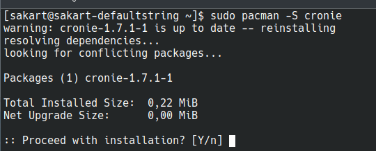
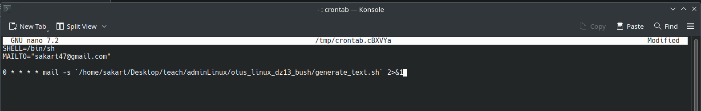
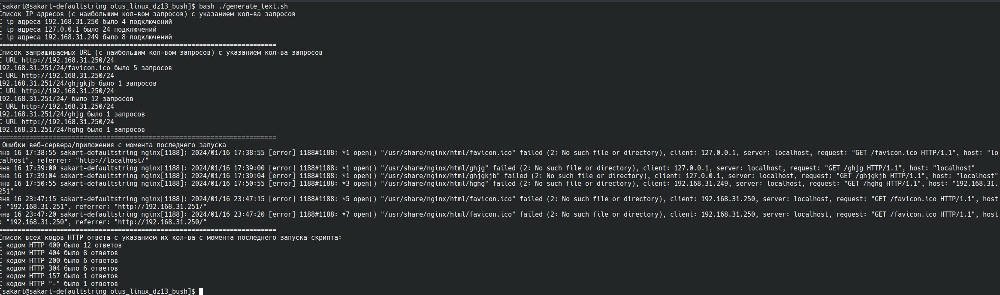

# otus_linux_dz13_bush

Написать скрипт для CRON, который раз в час будет формировать письмо и отправлять на заданную почту.

1. Ставим пакет крона.

   
2. Добавляем в крон задачу отправки письма каждый час.

   

3. Скрипт генерирует следующий текст.

   
